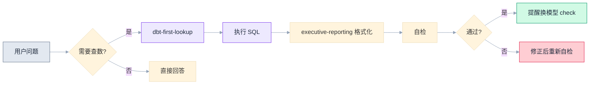

# 文档写作方法论

## 硬性规则（不可违反）

### 输出格式

1. **所有生成的文档必须是 Markdown 格式**，不允许其他格式（Word、HTML页面、纯文本等）
2. **图表优先级**：Mermaid → HTML（Mermaid 画不了时） → 其他工具
3. Mermaid 图必须遵守本 skill 中的审美规范（柔和配色，不用默认样式）

### 发布渠道

文档写完后，**如果用户配置了以下 MCP 服务，必须询问用户要发布到哪里**：

| MCP 服务 | 说明 |
|---------|------|
| `user-ding-doc-abilities` | 钉钉文档（支持 Mermaid 原生渲染） |
| `user-yuque` | 语雀（支持 Mermaid 原生渲染） |
| `user-atlassian-visable` | Atlassian Wiki（新版不支持 Mermaid，需截图） |

**询问模板**：
> 文档已生成。你希望发布到哪里？
> 1. 钉钉文档（Mermaid 可直接渲染）
> 2. 语雀（Mermaid 可直接渲染）
> 3. Wiki（Mermaid 需截图插入）
> 4. 只保留本地 .md 文件

**规则**：
- 如果用户没有配置任何发布 MCP，直接保留本地 .md 文件，不需要询问
- 如果用户之前已明确说过发哪里，后续不重复询问
- 发布到 Wiki 时，提醒用户 Mermaid 图需要截图处理

---

## 第零步：判断文档类型

拿到任务后第一件事：**这个文档是给谁看的？目的是什么？**

| 类型 | 受众 | 核心目的 | 写法 |
|------|------|---------|------|
| **汇报文档** | 老板/决策层 | 推动决策 | 结果前置 → 逆向拆解 → 行动建议 |
| **技术文档** | 工程团队 | 指导实现 | 问题 → 方案 → 实现细节 → 验证 |
| **分析文档** | 业务团队 | 理解现状 | 现象 → 归因 → 影响 → 建议 |
| **测试文档** | QA/开发 | 验证正确性 | 目标 → 用例 → 结果 → 结论 |
| **对外文档** | 客户/合作方 | 建立共识 | 背景 → 价值 → 方案 → 下一步 |

**判断依据**：
- 谁会读这个文档？（决策者/执行者/外部人）
- 读完后他需要做什么？（拍板/执行/理解/反馈）
- 他有多少时间？（2分钟/10分钟/30分钟）

---

## 汇报文档：结果前置 + 逆向拆解

### 核心原则：让老板第一眼就看到结论

老板打开文档的前 10 秒决定了他是认真看还是划走。

**正确顺序**（从结果到原因）：
```
结果（我发现了什么）
  ↓
判断（这意味着什么）
  ↓
拆解（我是怎么得出这个结论的）
  ↓
数据支撑（原始数据在这里）
  ↓
行动建议（所以我们应该做什么）
```

**错误顺序**（90% 的人这么写）：
```
背景（我做了什么）→ 过程（我怎么做的）→ 数据（看了哪些数据）→ 结论（所以...）
```

### 逆向拆解法

从结果开始，每一层回答"你凭什么这么说？"：

```
第 1 层：结论/判断
  "有定价的品询盘量是无定价的 5.9 倍"

第 2 层：怎么得出的？
  "同一个商家内，有定价和无定价的品分别统计品均 AB，控制了商家活跃度变量"

第 3 层：数据从哪来？
  "B 层 251K 商品，其中 1,332 家商家同时有定价和无定价品，共 89K 品"

第 4 层：口径是什么？
  "定价状态来源 DWM is_accurate_price_prod 字段，AB 来源 30 天去重"

第 5 层：可信度多高？
  "全量观测是 11.8 倍，控制后 5.9 倍，约一半差异来自选择偏差"
```

**读者可以在任何一层停下来**。老板看第 1 层就够了。追问"凭什么"就往下看一层。技术同事可以直接跳到第 4-5 层验证口径。

### 汇报文档模板

```markdown
# [判断式标题，不是主题式标题]

> 数据范围 · 口径说明 · 状态标注

## 一句话结论
[不超过 30 字的核心判断]

## 核心发现（3-5 个）

### 1. [发现一：判断句]
**结论**：[一句话]
**支撑**：[关键数字 + 对比基准]
**归因**：[为什么]
**建议**：[做什么 → 预期收益多少]

### 2. [发现二]
...

## 行动优先级
| # | 方向 | 预期收益 | 难度 | 时间线 |
|---|------|---------|------|--------|

## 风险与待验证
- ⚠ [假设 A] → 验证方式：[怎么验证]

## 附录
[详细数据、SQL、口径定义 — 不看也不影响理解正文]
```

---

## 白居易原则：受众感知

> 白居易每写一首诗，都让田间的老妇人读一遍。读不懂的地方就改，直到她能理解为止。

### 术语处理规则

**第一步：判断受众是否懂这个词**

| 受众 | 可以直接用的词 | 需要解释的词 |
|------|--------------|-------------|
| 内部技术团队 | CR-R2、PC→R2、AB2、PIS、dbt | — |
| 业务团队 | 转化率、询盘、匹配 | CR-R2 → "商家收到询盘后最终有买家回复的比率" |
| 老板/CEO | — | 所有缩写都要翻译成业务语言 |
| 跨团队/外部 | — | 假设对方什么都不懂 |

**第二步：就地解释，不另开章节**

```markdown
# 错误做法：术语表放在文末（没人会翻到那里去看）

# 正确做法：第一次出现时就地括号解释
商家的 CR-R2（收到询盘后最终有买家回复的比例）从 5.2% 提升到 8.5%。
```

**第三步：数字翻译成体感**

| 原始数字 | 翻译 |
|---------|------|
| CR-R2 1.5% | "每 100 条询盘只有 1.5 条带来买家回复" |
| 品均 AB 0.0013 | "平均 769 个商品才有 1 个询盘" |
| 96.6% 零曝光 | "30 万个商品里，只有 1 万个被买家看到过" |
| PC→R2 4.1% | "商家认真报了价，96% 石沉大海" |
| 5.9 倍 | "有定价的商品，询盘量接近无定价的 6 倍" |

### 自检清单（白居易测试）

写完文档后问自己：
- [ ] 一个不了解这个业务的人，能否在 30 秒内说出文档的核心结论？
- [ ] 文档中有没有未解释的缩写或术语？
- [ ] 每个数字是否都有一个"人话版本"的翻译？
- [ ] 去掉所有术语后，逻辑链条是否仍然成立？

---

## 语言策略：中文先行

### 为什么先写中文

1. **思考用母语最清晰**：先把逻辑理顺，再考虑表达
2. **避免"英文腔"**：直接写英文容易写成"像英文但不是好英文"
3. **中文稿 = 思考的记录**：翻译成英文是第二步，可以找人帮忙

### 中译英注意点

| 中文习惯 | 英文调整 |
|---------|---------|
| "我们发现..." | 去掉主语 → "Data shows..." |
| "建议继续观察" | 明确行动 → "Recommend monitoring X metric weekly for 4 weeks" |
| 段落长 | 每段不超过 3 句 |
| 标题用名词 | 标题用判断句 → "Pricing drives 5.9x more inquiries" |

---

## 确定性分层

文档中最重要的诚实：区分"我知道的"和"我猜的"

| 标注 | 含义 | 什么时候用 |
|------|------|-----------|
| **✓ 数据发现** | 数据直接支持，可复现 | 有 SQL/数据源可验证 |
| **⚠ 假设** | 推断，需要验证 | 必须配验证方式 |
| **→ So What** | 业务含义 + 行动建议 | 每个发现都要有 |

**规则**：
- 每个 ⚠ 假设必须写明"怎么验证"
- 不允许出现没有验证方式的假设
- "建议继续观察"不是行动建议

---

## 图文结合原则：不要只有表格和文字

**核心原则**：纯文字/表格的文档读起来累，关键流程和对比用图表达，让读者 3 秒抓住结构。

### 什么时候用图

| 场景 | 用图 | 不用图 |
|------|------|--------|
| 流程/步骤 | ✅ flowchart | 纯文字列 1234 |
| 趋势/时间序列 | ✅ 折线图 | 只贴一个表格 |
| 对比/占比 | ✅ bar/pie | 只写"A > B" |
| 架构/层次 | ✅ 架构图 | 纯缩进文字 |
| 单个数字/结论 | ❌ | 直接写即可 |

### 可视化工具优先级

```
优先级 1：Mermaid 图表
  ├─ 优点：纯文本、版本可控、钉钉/语雀原生支持
  ├─ 适用：流程图、时序图、甘特图、饼图、柱状图、思维导图
  ├─ 限制：Atlassian Wiki 新版不支持（旧版可以）
  └─ Wiki 解法：在钉钉/语雀中渲染后截图插入

优先级 2：HTML 可视化（AI 直接生成）
  ├─ 优点：无需安装任何插件，浏览器打开即可截图
  ├─ 适用：复杂图表（金字塔、漏斗、桑基图、热力图）
  ├─ 做法：让 AI 生成一个自包含的 HTML 文件 → 浏览器打开 → 截图
  └─ 场景：Mermaid 画不了的复杂可视化

优先级 3：外部工具
  ├─ draw.io / Excalidraw：复杂架构图
  ├─ Python matplotlib/plotly：数据量大的统计图
  └─ 其他在线工具：按需选用
```

### Mermaid 使用规范

#### 审美要求（极其重要）

**绝对不允许使用 Mermaid 默认配色**。默认灰色+蓝色的图非常丑，必须自定义配色。

**风格原则：柔和浅底色 + 深色边框 + 暗色文字**（参考 `nexus_ceo_overview_report_full.md` 中的图）

**每个 Mermaid 图必须包含 `%%{init}%%` 配置头**：

```
%%{init: {'theme': 'base', 'themeVariables': {'clusterBkg': '#ffffff', 'clusterBorder': '#e2e8f0', 'lineColor': '#94a3b8'}}}%%
```

#### 标准配色方案（柔和色系）

| 语义 | fill（浅底色） | stroke（深边框） | color | 用途 |
|------|--------------|-----------------|-------|------|
| 正面/稳定/结论 | `#d1fae5` | `#059669` | `#1e293b` | 结论、通过、完成 |
| 警告/瓶颈/判断 | `#fef3c7` | `#d97706` | `#1e293b` | 条件节点、需注意 |
| 错误/风险/问题 | `#fecdd3` | `#e11d48` | `#1e293b` | 失败、否定、已知 bug |
| 流程/中间步骤 | `#ede9fe` | `#7c3aed` | `#1e293b` | 步骤、方法、技术 |
| 中性/输入/辅助 | `#e2e8f0` | `#64748b` | `#1e293b` | 起点、来源、备注 |
| 连接线 | — | — | `#94a3b8` | 所有连接线 |
| 子图背景 | `#ffffff` | `#e2e8f0` | — | subgraph 背景 |

**核心规则**：
- 文字永远是 `color:#1e293b`（暗色），**绝不用白字**
- 填充色永远是**浅/柔和色**，**绝不用深色填充**
- 边框色是填充色的深色版本，形成层次

#### 风格规范

1. **节点样式**：使用 `style` 语法为关键节点上色（起点、终点、判断点）
2. **不要用 emoji**：节点文字保持干净，不加 emoji
3. **圆角引号**：节点文字用双引号包裹 `["文字"]` 确保中文正常渲染
4. **换行用 `\n`**：多行文字用 `\n` 换行，不用 `<br/>`
5. **留白**：不要把太多节点挤在一张图里，超过 8-10 个节点考虑拆分
6. **图例说明**：图下方用 blockquote 说明颜色含义（如 `> 图例：绿 = 稳定 ｜ 黄 = 瓶颈 ｜ 粉 = 已知问题`）

#### Mermaid 示例



**Wiki 中的处理**：
- 新版 Atlassian Wiki 不支持 Mermaid → 在钉钉文档中渲染好后截图，以图片形式插入 Wiki
- 旧版 Wiki 有 Mermaid 插件 → 可以直接用

### HTML 图表使用场景

当 Mermaid 画不了的时候（金字塔、复杂漏斗、多维度对比）：

```
让 AI 生成 → 保存为 .html → 浏览器打开 → 截图插入文档
```

已有的 HTML 图表模板（在项目中）：
- `v_pis_pyramid.html` — 金字塔图
- `nexus_rfq_funnel.html` — 漏斗图
- `uc19_buyer_ab2_pyramid.html` — 层级对比图

#### HTML 图表审美规范

**绝对不允许用原始、丑陋的配色**。参考以上模板的视觉风格：

| 设计要素 | 规范 |
|---------|------|
| 字体 | `-apple-system, BlinkMacSystemFont, "Segoe UI", Roboto, sans-serif` |
| 背景 | 白底 `#fff`，不要灰色背景 |
| 标题 | `font-size: 16px; font-weight: 800; color: #1a1a1a` |
| 副标题 | `font-size: 11px; color: #94a3b8` |
| 主色调 | 绿色系 `#2e7d32 → #388e3c → #43a047 → #66bb6a → #a5d6a7` |
| 点缀色 | 橙色 `#e65100 → #f57c00` 用于高亮/告警 |
| 标注背景 | 浅绿 `#f0fdf4` / 浅橙 `#fff3e0` / 浅红 `#fce4ec` |
| 圆角 | `border-radius: 8px`（卡片/标签） |
| 间距 | 充足留白，`padding: 24px+`，元素间 `gap: 12-20px` |
| 数字 | `font-weight: 800; font-size: 16px` 突出关键数据 |
| 箭头/转化率 | 橙色小标签 `background: #fff3e0; color: #e65100; border-radius: 8px` |

**生成新 HTML 图表的 prompt 模板**：
> "帮我画一个 [图表类型]，数据是 [数据]，要求自包含 HTML，浏览器直接打开可以看到。
> 参考 `v_pis_pyramid.html` 的设计风格：白底、绿色系主色、橙色点缀、
> -apple-system 字体、圆角标签、充足留白。不要用默认样式。"

---

## 演讲节奏

### 15 分钟版

| 时间 | 内容 | 关键 |
|------|------|------|
| 0-2 min | 一句话结论 + 全局判断 | 定调，让人想听下去 |
| 2-8 min | 3 个核心发现（每个 2 min） | 结论→数据→so what |
| 8-11 min | 优先级排序 + 行动建议 | 具体、可执行、有时间线 |
| 11-13 min | 风险和不确定的东西 | 诚实，建立信任 |
| 13-15 min | 请求决策/资源 | 不是"以上是汇报"，是"我需要 X" |

### 演讲原则

- **前 2 分钟决定成败**。如果老板 2 分钟后还不知道你要说什么，就失败了
- **每 5 分钟一个钩子**：反直觉发现、冲击性数字、具体案例
- **结尾是请求不是总结**："我建议做 X，需要 Y 资源"

---

## 不同文档类型的差异处理

### 技术文档

```markdown
## 问题
[什么问题，影响范围]

## 方案
[怎么解决，为什么选这个方案]

## 实现
[具体代码/配置/步骤]

## 验证
[怎么确认修好了]
```

- 可以用术语，不需要翻译
- 重点是可复现性：别人照着做能得到相同结果
- 代码/SQL/配置要可以直接复制运行

### 分析文档

```markdown
## 核心发现
[3-5 个判断]

## 详细分析
[每个发现的拆解过程]

## 数据口径
[用了什么表、什么条件、什么时间范围]

## 建议
[基于分析的行动建议]
```

- 受众是业务团队，术语要适度解释
- 重点是归因：不止"是什么"，还要"为什么"
- 每个数字都要有对比基准

---

## 自检流程（每次输出前必须执行）

文档写完后，**交付前必须走一遍自检**。不自检就发出去，等于没校对就交卷。

### 自检清单

#### 1. 数据准确性检查

| 检查项 | 方法 | 通过标准 |
|-------|------|---------|
| SQL 口径是否正确 | 回到 dbt 核对 WHERE/JOIN 条件 | 与 dbt model 完全一致 |
| 数字加总是否正确 | 子项相加是否等于总计 | 误差 < 0.1% |
| 百分比计算正确 | 分子/分母是否明确 | 可手动复算验证 |
| 时间范围一致 | 各表/各图用的时间范围是否相同 | 统一标注数据期间 |
| 对比基准正确 | 环比/同比的基准期是否正确 | 明确标注 vs 什么 |

**执行方式**：重新跑一次核心 SQL，对比文档中的关键数字。如果发现不一致，必须修正后再交付。

#### 2. 逻辑自洽检查

| 检查项 | 方法 |
|-------|------|
| 结论是否被数据支持 | 每个结论反向追溯：凭什么这么说？数据在哪？ |
| 因果推断是否合理 | 是真的因果，还是只是相关？有没有混淆变量？ |
| 行动建议是否可行 | 建议的事情，团队能做吗？有资源吗？有时间线吗？ |
| 是否有遗漏的替代解释 | 同样的数据，有没有其他可能的解读？ |

#### 3. 受众匹配检查（白居易测试）

- [ ] 一个不了解业务的人，30 秒内能说出核心结论吗？
- [ ] 所有缩写/术语都在首次出现时解释了吗？
- [ ] 每个关键数字都有"人话翻译"吗？
- [ ] 去掉术语后逻辑链条仍然成立吗？

#### 4. 完整性检查

- [ ] 每个发现都有 So What（行动建议）吗？
- [ ] 确定性分层标注了吗（✓ 数据发现 / ⚠ 假设 / → 建议）？
- [ ] 假设都写了验证方式吗？
- [ ] 口径来源标注了吗？

### 自检后提醒

自检完成后，在文档末尾或对话中提醒用户：

```
✅ 自检完成：
- 核心数字已复算验证
- 逻辑链条已反向追溯
- 白居易测试已通过
- 确定性分层已标注

💡 建议：是否需要换一个模型做交叉验证？
（不同模型可能发现不同的逻辑漏洞或数据解读偏差）
```

---

## 常见错误

| # | 错误 | 正确 |
|---|------|------|
| 1 | 从背景/过程开始写 | **结果先写**，背景按需补充 |
| 2 | 所有内容平铺一个层级 | **分层**：结论→支撑→细节→附录 |
| 3 | 术语不解释 | **首次出现括号解释** |
| 4 | 数字不翻译 | **每个关键数字配一句人话** |
| 5 | 只有发现没有建议 | **每个发现配 So What** |
| 6 | "建议继续观察" | **具体行动 + 时间线 + 预期收益** |
| 7 | 确定和不确定混在一起 | **用 ✓/⚠/→ 分层标注** |
| 8 | 给所有人写同一份 | **先判断受众，再决定深度和术语** |
| 9 | 直接写英文 | **中文理清逻辑，再翻译** |
| 10 | 把数据口径放正文 | **口径放附录**，正文只放结论和关键数字 |
