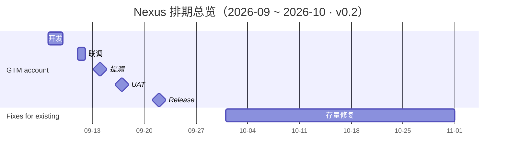

# Nexus 项目 Roadmap

> 状态：持续更新 · 版本 v0.2 · 最后更新 2026-08-27 · 已收录条目：2

## 概览

Nexus 项目 9 月首发需求为 **GTM account**：9 月 7 日（周一）进入开发，9 月 22 日（周二）release，全程 16 天。存量修复项目 **fixes for existing** 自 10 月起投入人力，9 月不占用资源。其余需求排期待补充，将陆续追加至本文档。

## 时间线总览

读图提示：GTM account 的五个节点集中在 9 月 7 日至 22 日；9.22 发布后到 10 月初是两个条目之间的资源空档；fixes for existing 以 10-01 为示意起点，结束日期待需求范围明确后更新。

## 里程碑一览

| 日期 | 星期 | 条目 | 节点 |
|---|---|---|---|
| 2026-09-07 ~ 09-08 | 周一 ~ 周二 | GTM account | 开发 |
| 2026-09-11 | 周五 | GTM account | 联调 |
| 2026-09-14 | 周一 | GTM account | 提测 |
| 2026-09-17 | 周四 | GTM account | UAT |
| 2026-09-22 | 周二 | GTM account | Release |
| 2026-10-01 起 | 周四 | Fixes for existing | 投入开发（起始日待确认） |

## 排期详情

### GTM account（首发需求）

| 阶段 | 日期 | 星期 | 说明 |
|---|---|---|---|
| 开发 | 09-07 ~ 09-08 | 周一 ~ 周二 | 开发窗口共 2 天 |
| （空档） | 09-09 ~ 09-10 | 周三 ~ 周四 | 用途待确认（推断可用作自测/缓冲） |
| 联调 | 09-11 | 周五 | — |
| 提测 | 09-14 | 周一 | — |
| UAT | 09-17 | 周四 | — |
| Release | 09-22 | 周二 | — |

### Fixes for existing（存量修复项目）

- **投入时间**：2026 年 10 月起（10 月份之后投入），9 月不投入资源
- **范围与排期**：待补充
- **备注**：甘特图以 10-01 为示意起点，确切起始日与迭代节奏待确认

## 待补充需求

后续需求按下表口径补充（已有信息填入，未定的留空或标注"待定"）：

| 需求 | 开发 | 联调 | 提测 | UAT | Release | 备注 |
|---|---|---|---|---|---|---|
| （待补充） | | | | | | |

## 待确认事项

1. **fixes for existing 起始时点**：确认确切投入日期（10 月初或更晚）及首个迭代范围。
2. **9.9 ~ 9.10 空档用途**：自测、缓冲还是其他安排。

## 更新记录

| 版本 | 日期 | 变更 |
|---|---|---|
| v0.2 | 2026-08-27 | 提测日由 9.13（周日）调整为 9.14（周一）；移除 QA 修复窗口、发布准备等推断性排期内容 |
| v0.1 | 2026-08-26 | 初始创建：GTM account 完整排期；fixes for existing 投入时间 |
