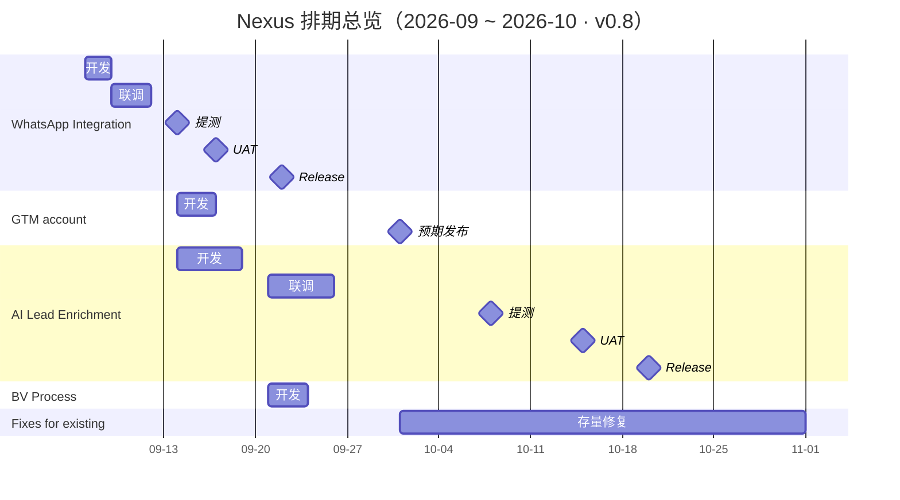

# Nexus 项目 Roadmap

> 状态：持续更新 · 版本 v1.0 · 最后更新 2026-09-01 · 已收录条目：5

## 概览

Nexus 项目 9 月首发需求为 **WhatsApp Integration**：9 月 7 日（周一）进入开发，9 月 22 日（周二）release，全程 16 天。**AI Lead Enrichment** 前端开发 9 月 14 日 ~ 9 月 18 日，联调 9 月 21 日 ~ 25 日，10 月 8 日提测、10 月 15 日 UAT、10 月 20 日发布。**GTM account** 开发暂定 9 月 14 日 ~ 16 日（3 天），预期 10 月 1 日（周四）发布，联调 / 提测 / UAT 节点待排期确认后补入。**BV Process** 前端开发 9 月 21 日 ~ 23 日（3 天），测试 / 发布时间待定。存量修复项目 **fixes for existing** 自 10 月起投入人力，9 月不占用资源。其余需求排期待补充，将陆续追加至本文档。

## 时间线总览

读图提示：WhatsApp Integration 的五个节点集中在 9 月 7 日至 22 日；AI Lead Enrichment 开发窗口 9.14 ~ 9.18（与 WhatsApp Integration 提测 / UAT 期重叠），10 月三个节点各隔一周；GTM account 开发暂定 9.14 ~ 9.16，图中仅标出预期 10-01 发布节点；BV Process 开发窗口 9.21 ~ 9.23（3 天，与 AI Lead Enrichment 联调期重叠），测试 / 发布待定；fixes for existing 以 10-01 为示意起点，结束日期待需求范围明确后更新。

## 里程碑一览

| 日期               | 星期        | 条目                 | 节点                        |
| ------------------ | ----------- | -------------------- | --------------------------- |
| 2026-09-07 ~ 09-08 | 周一 ~ 周二 | WhatsApp Integration | 开发                        |
| 2026-09-09 ~ 09-11 | 周三 ~ 周五 | WhatsApp Integration | 联调                        |
| 2026-09-14 ~ 09-18 | 周一 ~ 周五 | AI Lead Enrichment   | 开发                        |
| 2026-09-14 ~ 09-16 | 周一 ~ 周三 | GTM account          | 开发（暂定）                |
| 2026-09-14         | 周一        | WhatsApp Integration | 提测                        |
| 2026-09-17         | 周四        | WhatsApp Integration | UAT                         |
| 2026-09-21 ~ 09-25 | 周一 ~ 周五 | AI Lead Enrichment   | 联调                        |
| 2026-09-21 ~ 09-23 | 周一 ~ 周三 | BV Process           | 开发                        |
| 2026-09-22         | 周二        | WhatsApp Integration | Release                     |
| 2026-10-01（预期） | 周四        | GTM account          | Release（排期未定，待确认） |
| 2026-10-01 起      | 周四        | Fixes for existing   | 投入开发（起始日待确认）    |
| 2026-10-08         | 周四        | AI Lead Enrichment   | 提测                        |
| 2026-10-15         | 周四        | AI Lead Enrichment   | UAT                         |
| 2026-10-20         | 周二        | AI Lead Enrichment   | Release                     |

## 排期详情

### WhatsApp Integration（首发需求）

| 阶段    | 日期          | 星期        | 说明            |
| ------- | ------------- | ----------- | --------------- |
| 开发    | 09-07 ~ 09-08 | 周一 ~ 周二 | 开发窗口共 2 天 |
| 联调    | 09-09 ~ 09-11 | 周三 ~ 周五 | —               |
| 提测    | 09-14         | 周一        | —               |
| UAT     | 09-17         | 周四        | —               |
| Release | 09-22         | 周二        | —               |

### GTM account（开发暂定，其余待定）

- **排期状态**：开发暂定，联调 / 提测 / UAT 节点均待确认
- **开发**：09-14 ~ 09-16（周一 ~ 周三，3 天，暂定）
- **预期 Release**：2026-10-01（周四）
- **备注**：开发窗口与 AI Lead Enrichment 开发窗口（9.14 ~ 9.18）及 WhatsApp Integration 提测日（9.14）重叠，若为同一批前端人力需注意排布；v0.2 中记录的 9.7 ~ 9.22 排期经确认为 WhatsApp Integration 的排期，已在该条目下更正

### AI Lead Enrichment

| 阶段    | 日期          | 星期        | 说明                      |
| ------- | ------------- | ----------- | ------------------------- |
| 开发    | 09-14 ~ 09-18 | 周一 ~ 周五 | 前端开发窗口共 5 天       |
| 联调    | 09-21 ~ 09-25 | 周一 ~ 周五 | 开发结束后紧接着进入联调  |
| 提测    | 10-08         | 周四        | 联调结束到提测间隔约 2 周 |
| UAT     | 10-15         | 周四        | —                         |
| Release | 10-20         | 周二        | —                         |

备注：开发窗口（9.14 ~ 9.18）与 WhatsApp Integration 的提测（9.14）、UAT（9.17）时间重叠，若为同一批前端人力需注意排布。

### BV Process

| 阶段    | 日期          | 星期        | 说明              |
| ------- | ------------- | ----------- | ----------------- |
| 开发    | 09-21 ~ 09-23 | 周一 ~ 周三 | 前端开发量共 3 天 |
| 提测    | 待定          | —           | —                 |
| Release | 待定          | —           | —                 |

备注：开发窗口（9.21 ~ 9.23）与 AI Lead Enrichment 联调窗口（9.21 ~ 9.25）重叠，且开发第二日（9.22）为 WhatsApp Integration 发布日，若为同一批前端人力需注意排布。

### Fixes for existing（存量修复项目）

- **投入时间**：2026 年 10 月起（10 月份之后投入），9 月不投入资源
- **范围与排期**：待补充
- **备注**：甘特图以 10-01 为示意起点，确切起始日与迭代节奏待确认

## 待补充需求

后续需求按下表口径补充（已有信息填入，未定的留空或标注"待定"）：

| 需求       | 开发 | 联调 | 提测 | UAT | Release | 备注 |
| ---------- | ---- | ---- | ---- | --- | ------- | ---- |
| （待补充） |      |      |      |     |         |      |

## 待确认事项

1. **GTM account 排期**：确认联调 / 提测 / UAT 各节点，以及预期 10.1 发布日是否可行（开发暂定 9.14 ~ 9.16）。
2. **BV Process 测试 / 发布时间**：开发窗口已定 9.21 ~ 9.23，测试与发布节点待确认。
3. **fixes for existing 起始时点**：确认确切投入日期（10 月初或更晚）及首个迭代范围。

## 更新记录

| 版本 | 日期       | 变更                                                                                                                                                                |
| ---- | ---------- | ------------------------------------------------------------------------------------------------------------------------------------------------------------------- |
| v1.0 | 2026-09-01 | BV Process 开发窗口由 10.8 ~ 10.10 提前至 9.21 ~ 9.23（周一 ~ 周三，3 天），与 AI Lead Enrichment 联调期重叠；测试 / 发布仍待定，甘特图 / 里程碑 / 排期图同步更新   |
| v0.9 | 2026-09-01 | 排期图配色改为按阶段统一：开发蓝 / 联调橙 / 提测黄 / UAT 紫 / Release 红（项目归属仍由左侧项目名色块区分）；图例拆分提测与 UAT 项；补 WhatsApp 联调条缺失的阶段文字 |
| v0.8 | 2026-09-01 | GTM account 开发窗口暂定 9.14 ~ 9.16（3 天），预期 10.1 发布不变；排期图同步新增开发条与图例对齐修正                                                                |
| v0.7 | 2026-08-31 | AI Lead Enrichment 新增联调节点 9.21 ~ 9.25（5 天）；排期图新增联调行，下游条目整体下移                                                                             |
| v0.6 | 2026-08-31 | WhatsApp Integration 联调扩展为 9.9 ~ 9.11（3 天），原 9.9 ~ 9.10 空档取消，待确认事项同步删减                                                                      |
| v0.5 | 2026-08-31 | BV Process 更正为前端需投入：开发 10.8 ~ 10.10（3 天），测试 / 发布待定；甘特图 / 里程碑 / 排期图同步更新                                                           |
| v0.4 | 2026-08-31 | 新增 AI Lead Enrichment 排期（开发 9.14 ~ 9.18、提测 10.8、UAT 10.15、发布 10.20）；新增 BV Process（前端预计不投入，待确认）                                       |
| v0.3 | 2026-08-31 | 更正条目归属：v0.2 中 GTM account 的 9.7 ~ 9.22 排期实际为 WhatsApp Integration 的排期；GTM account 排期未定，预期 10.1 发布                                        |
| v0.2 | 2026-08-27 | 提测日由 9.13（周日）调整为 9.14（周一）；移除 QA 修复窗口、发布准备等推断性排期内容                                                                                |
| v0.1 | 2026-08-26 | 初始创建：GTM account 完整排期；fixes for existing 投入时间                                                                                                         |
