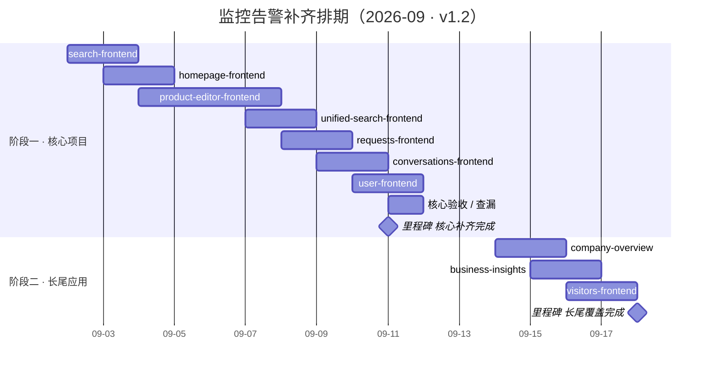

# 监控告警补齐排期（Monitor-Alert Roadmap）

> 状态：持续更新 · 版本 v1.2 · 最后更新 2026-09-04 · 周期 2026-09-02 ~ 2026-09-18 · 已收录条目：13（11 个任务条 + 2 个里程碑）
>
> 范围数据源：[监控告警补全计划](../../knowledge-base/monitoring-alert-补全计划.md)（Sunfire 新建 48 条 + Datadog 新建 39 条 + 清理 8 条；09-04 增补 user-frontend）。本文档为排期 source of truth，[ROADMAP.drawio](./ROADMAP.drawio) 为可视化衍生，两处同步修改。

## 概览

从 9.2（周三）到 9.11（下周五）完成核心 7 项目 —— search-frontend、homepage-frontend、requests-frontend、conversations-frontend、unified-search-frontend、product-editor-frontend、user-frontend —— 的 **Sunfire + Datadog 双平台监控补齐**；随后 9.14 ~ 9.18 完成 supplier 剩余长尾应用（company-overview、business-insights-frontend、visitors-frontend）的监控覆盖，**9.18（周五）全部收口**。

阶段划分：

- **阶段一 · 核心项目监控补齐（09-02 ~ 09-11，8 个工作日）**：7 个项目逐个补齐，每项约 2 天（首个项目顺带固化告警模板与阈值基线；user-frontend 为 09-04 增补、含前置盘点，核心验收压缩至 9.11 单日）。工作量按补全计划条目映射：轻则 search-frontend 仅补 2 条 Sunfire，重则 product-editor / requests / conversations 双平台全套 8~12 条。
- **阶段二 · 长尾应用监控覆盖（09-14 ~ 09-18，5 个工作日）**：supplier 剩余长尾应用即 company-overview（仅 Sunfire，Datadog 未接入跳过）、business-insights、visitors-frontend，各约 2 天；监控方案待定（倾向 supplier 域维度大盘监控 + 特定场景监控，而非逐应用告警模板）；9.18 为缓冲收口日。

> 本版对齐 FE Epic [FE-1066](https://visable.atlassian.net/browse/FE-1066)：阶段一 = [FE-1067](https://visable.atlassian.net/browse/FE-1067)（9.11 前），阶段二 = [FE-1068](https://visable.atlassian.net/browse/FE-1068)（9.18 前）。

## 时间线总览

读图提示：相邻任务条重叠 1 天表示当天交接（如 search 9.3 收尾时 homepage 同日切入）；product-editor 条跨 9.5 ~ 9.6 周末，实际工作日为 9.4（周五）+ 9.7（周一）2 天；user-frontend（9.10 ~ 9.11）为 09-04 增补，核心验收压缩至 9.11 单日、与其收尾同日；9.11 验收完成后阶段二从 9.14（周一）启动。drawio 图示时间轴为 **08-26 ~ 09-25**：按默认缓冲规则在排期前后各多展示一周空白（轴起 = min(今天, 最早任务)−7 天，轴止 = 最晚任务+7 天），供后续追加任务（如阈值校准）使用。

## 里程碑一览

| 日期       | 星期 | 里程碑                 | 说明                                   |
| ---------- | ---- | ---------------------- | -------------------------------------- |
| 2026-09-11 | 周五 | 核心项目监控补齐完成   | 7 个核心项目 Sunfire + Datadog 全部到位 |
| 2026-09-18 | 周五 | 长尾应用监控覆盖完成   | 长尾应用全部覆盖（含 supplier 方案落地），整体收口 |

## 排期详情

### 阶段一 · 核心项目监控补齐（09-02 ~ 09-11）

| 日期             | 星期          | 条目                   | 工作内容（对应补全计划条目）                                                              |
| ---------------- | ------------- | ---------------------- | ----------------------------------------------------------------------------------------- |
| 09-02 ~ 09-03    | 周三 ~ 周四   | search-frontend       | Sunfire 补 api_error / script_error 告警（S-01 ~ S-02）；首个项目顺带固化告警模板与阈值基线；Datadog 已 6/6 仅核验 |
| 09-03 ~ 09-04    | 周四 ~ 周五   | homepage-frontend     | Sunfire S-03 ~ S-04；Datadog 补 SSR 渲染错误（D-09）                                        |
| 09-04 ~ 09-07    | 周五 ~ 周一   | product-editor-frontend | Datadog 全套新建（D-01 ~ D-06）；Sunfire S-05 ~ S-06。跨周末，实际 2 个工作日              |
| 09-07 ~ 09-08    | 周一 ~ 周二   | unified-search-frontend | Sunfire 全 6 类新建（S-07 ~ S-12）；Datadog 补 CPU / Memory（D-07 ~ D-08）；旧规则退役（R-01 ~ R-03） |
| 09-08 ~ 09-09    | 周二 ~ 周三   | requests-frontend     | 前置：Stability SDK 接入状态确认；Sunfire S-25 ~ S-30；Datadog 全套（D-18 ~ D-23）         |
| 09-09 ~ 09-10    | 周三 ~ 周四   | conversations-frontend | 前置：Stability SDK 接入状态确认；Sunfire S-37 ~ S-42；Datadog 全套（D-30 ~ D-35）         |
| 09-10 ~ 09-11    | 周四 ~ 周五   | user-frontend         | 09-04 增补。前置：Stability SDK 落库确认 + Datadog 数据面盘点（APM / Logs / service tag / 通知群）；Sunfire S-43 ~ S-48；Datadog 补常规六件套（D-36 ~ D-41，已有 3 条容器全灭 P1 不计入标准模板） |
| 09-11            | 周五          | 核心验收 / 查漏        | 7 项目双平台全量核验、阈值抽查、查漏补缺（与 user-frontend 收尾同日）；**9.11 里程碑：核心项目监控补齐完成** |

### 阶段二 · 长尾应用监控覆盖（09-14 ~ 09-18）

| 日期          | 星期        | 条目                | 工作内容（对应补全计划条目）                                                                |
| ------------- | ----------- | ------------------- | ------------------------------------------------------------------------------------------- |
| 09-14 ~ 09-15  | 周一 ~ 周二 | company-overview    | 前置：SDK 接入状态确认，未接入先接入；Sunfire S-13 ~ S-18。Datadog 未接入，跳过（D-10 ~ D-11 已划掉） |
| 09-15 ~ 09-16  | 周二 ~ 周三 | business-insights   | Sunfire S-19 ~ S-24；Datadog D-12 ~ D-17（通知走 Teams pegasus-alerts）                     |
| 09-16 ~ 09-17  | 周三 ~ 周四 | visitors-frontend   | Sunfire S-31 ~ S-36；Datadog D-24 ~ D-29                                                    |
| 09-18          | 周五        | 缓冲 / 收口          | supplier 剩余长尾应用监控方案决策（方案待定：supplier 域维度大盘监控 + 特定场景监控）、整体收尾核验；**里程碑：长尾应用监控覆盖完成** |

## 待确认事项

1. **扩展项目 SDK 接入状态待盘点**：requests / conversations / user-frontend / company-overview / business-insights / visitors 六个应用的 Stability SDK 接入情况未确认——未接入的需先完成接入（参照补全计划 §3.1.3 前提），会放大阶段一末三项与整个阶段二的工作量。
2. **user-frontend Datadog 数据面待确认**：ECS 集成已确认（3 条容器全灭 P1 已建），但 APM trace / Logs 是否上报、Datadog service tag 实际值、通知渠道均待盘点，直接影响 D-36 ~ D-41 可建性。
3. **supplier 剩余长尾应用监控方案待定**：supplier 剩余长尾应用即 company-overview / business-insights-frontend / visitors-frontend；倾向 supplier 域维度大盘监控 + 特定场景监控，而非逐应用告警模板，需在 9.18 前完成决策。
4. **阈值校准不在本排期内**：告警上线后观察 1~2 周再按实际基线校准（api_error / script_error 按项目流量调整），预计 9 月底进行。
5. **9.18 deadline 风险**：若 SDK 接入工作量超预期，长尾应用覆盖存在延期风险，届时优先保证 Sunfire 告警落地、Datadog 顺延。

## 更新记录

| 版本 | 日期       | 变更                                                                                     |
| ---- | ---------- | ---------------------------------------------------------------------------------------- |
| v1.0 | 2026-09-02 | 初版：核心 6 项目 9.11 前双平台补齐 + 长尾 3 应用 9.18 前覆盖，共 12 条目、2 个里程碑。 |
| v1.1 | 2026-09-02 | drawio 时间轴扩展为 08-26 ~ 09-25（排期前后各留一周缓冲，规则沉淀入 drawio-roadmap 技能）；排期条目与日期不变。 |
| v1.2 | 2026-09-04 | 对齐 FE-1066 Epic（阶段一 = FE-1067 / 阶段二 = FE-1068）：增补 user-frontend（S-43 ~ S-48 / D-36 ~ D-41，排期 09-10 ~ 09-11，验收压缩至 09-11）；阶段二 = supplier 剩余长尾应用（即 company-overview / business-insights / visitors-frontend，方案待定），v-content-generator 清理（R-04）移出排期、保留于补全计划 §3.3；核心 6 → 7 项目，条目 12 → 13。 |
