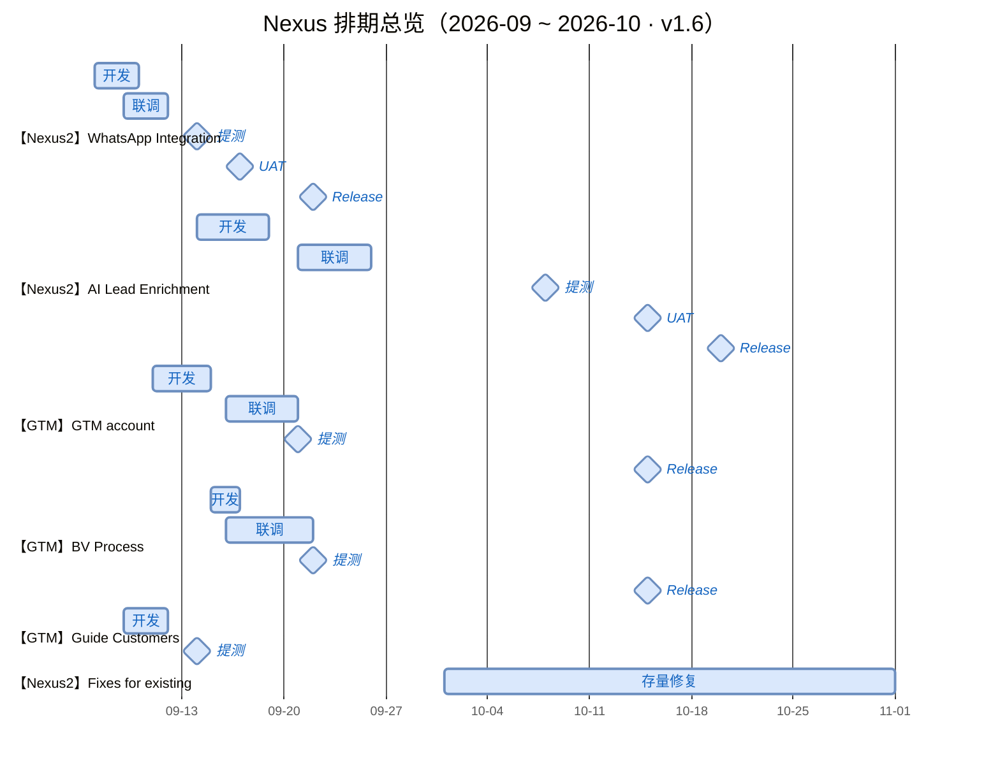

# Nexus 项目 Roadmap

> 状态：持续更新 · 版本 v1.6 · 最后更新 2026-09-14 · 已收录条目：7

## 概览

Nexus 项目 9 月首发需求为 **【Nexus2】WhatsApp Integration**：9 月 7 日（周一）进入开发（开发窗口 9 月 7 日 ~ 9 日，3 天），9 月 22 日（周二）release，全程 16 天。**【Nexus2】AI Lead Enrichment** 前端开发 9 月 14 日 ~ 9 月 18 日，联调 9 月 21 日 ~ 25 日，10 月 8 日提测、10 月 15 日 UAT、10 月 20 日发布。**【GTM】GTM account** 开发 9 月 11 日 ~ 14 日（周五 ~ 下周一，含周六 9 月 12 日加班），联调 9 月 16 日 ~ 20 日（至提测前一日），9 月 21 日（周一）提测，10 月 15 日（周四）发布，UAT 节点待确认。**【GTM】BV Process** 前端开发 9 月 15 日 ~ 16 日（2 天），联调 9 月 16 日 ~ 21 日（开发末日即联调首日，至提测前一日），9 月 22 日（周二）提测，10 月 15 日（周四）发布。**【GTM】Guide Customers to Create Products Optimized for Alibaba** 前端 3 人日，开发 9 月 9 日 ~ 11 日（周三 ~ 周五），9 月 14 日（周一）提测，发布时间待定。**【GTM】Synchronize Visable Product Changes to Alibaba** 前端暂不投入资源，排期待定。存量修复项目 **【Nexus2】fixes for existing** 自 10 月起投入人力，9 月不占用资源。其余需求排期待补充，将陆续追加至本文档。

## 时间线总览

读图提示：【Nexus2】WhatsApp Integration 的五个节点集中在 9 月 7 日至 22 日（开发 9.7 ~ 9.9，联调首日 9.9 与开发末日重合）；【Nexus2】AI Lead Enrichment 开发窗口 9.14 ~ 9.18（与【Nexus2】WhatsApp Integration 提测 / UAT 期重叠），10 月三个节点各隔一周；【GTM】GTM account 开发窗口 9.11 ~ 9.14（周五 ~ 下周一，含周六 9.12 加班、跨周末），联调 9.16 ~ 9.20（至提测前一日、跨周末），提测 9.21，发布 10.15（UAT 待确认）；【GTM】BV Process 开发窗口 9.15 ~ 9.16（2 天，落在【Nexus2】AI Lead Enrichment 开发窗口内），联调 9.16 ~ 9.21（开发末日即联调首日、跨周末），提测 9.22，发布 10.15；【GTM】Guide Customers to Create Products Optimized for Alibaba 开发窗口 9.9 ~ 9.11（3 人日，与【Nexus2】WhatsApp Integration 联调窗口重叠），提测 9.14（与【Nexus2】WhatsApp Integration 提测同日），发布待定；【Nexus2】fixes for existing 以 10-01 为示意起点，结束日期待需求范围明确后更新。

## 里程碑一览

| 日期               | 星期        | 条目                 | 节点                        |
| ------------------ | ----------- | -------------------- | --------------------------- |
| 2026-09-07 ~ 09-09 | 周一 ~ 周三 | 【Nexus2】WhatsApp Integration | 开发                        |
| 2026-09-09 ~ 09-11 | 周三 ~ 周五 | 【Nexus2】WhatsApp Integration | 联调                        |
| 2026-09-09 ~ 09-11 | 周三 ~ 周五 | 【GTM】Guide Customers to Create Products Optimized for Alibaba | 开发（3 人日）              |
| 2026-09-11 ~ 09-14 | 周五 ~ 周一 | 【GTM】GTM account          | 开发（含周六 9.12 加班）    |
| 2026-09-14 ~ 09-18 | 周一 ~ 周五 | 【Nexus2】AI Lead Enrichment   | 开发                        |
| 2026-09-14         | 周一        | 【Nexus2】WhatsApp Integration | 提测                        |
| 2026-09-14         | 周一        | 【GTM】Guide Customers to Create Products Optimized for Alibaba | 提测                        |
| 2026-09-15 ~ 09-16 | 周二 ~ 周三 | 【GTM】BV Process           | 开发                        |
| 2026-09-16 ~ 09-20 | 周三 ~ 周日 | 【GTM】GTM account          | 联调（至提测前一日）        |
| 2026-09-16 ~ 09-21 | 周三 ~ 周一 | 【GTM】BV Process           | 联调（至提测前一日）        |
| 2026-09-17         | 周四        | 【Nexus2】WhatsApp Integration | UAT                         |
| 2026-09-21 ~ 09-25 | 周一 ~ 周五 | 【Nexus2】AI Lead Enrichment   | 联调                        |
| 2026-09-21         | 周一        | 【GTM】GTM account          | 提测                        |
| 2026-09-22         | 周二        | 【Nexus2】WhatsApp Integration | Release                     |
| 2026-09-22         | 周二        | 【GTM】BV Process           | 提测                        |
| 2026-10-01 起      | 周四        | 【Nexus2】Fixes for existing   | 投入开发（起始日待确认）    |
| 2026-10-08         | 周四        | 【Nexus2】AI Lead Enrichment   | 提测                        |
| 2026-10-15         | 周四        | 【Nexus2】AI Lead Enrichment   | UAT                         |
| 2026-10-15         | 周四        | 【GTM】GTM account          | Release                     |
| 2026-10-15         | 周四        | 【GTM】BV Process           | Release                     |
| 2026-10-20         | 周二        | 【Nexus2】AI Lead Enrichment   | Release                     |

## 排期详情

### 【Nexus2】WhatsApp Integration（首发需求）

| 阶段    | 日期          | 星期        | 说明            |
| ------- | ------------- | ----------- | --------------- |
| 开发    | 09-07 ~ 09-09 | 周一 ~ 周三 | 开发窗口共 3 天 |
| 联调    | 09-09 ~ 09-11 | 周三 ~ 周五 | —               |
| 提测    | 09-14         | 周一        | —               |
| UAT     | 09-17         | 周四        | —               |
| Release | 09-22         | 周二        | —               |

备注：开发末日（9.9）与联调首日重合，当天开发收尾后进入联调。

### 【Nexus2】AI Lead Enrichment

| 阶段    | 日期          | 星期        | 说明                      |
| ------- | ------------- | ----------- | ------------------------- |
| 开发    | 09-14 ~ 09-18 | 周一 ~ 周五 | 前端开发窗口共 5 天       |
| 联调    | 09-21 ~ 09-25 | 周一 ~ 周五 | 开发结束后紧接着进入联调  |
| 提测    | 10-08         | 周四        | 联调结束到提测间隔约 2 周 |
| UAT     | 10-15         | 周四        | —                         |
| Release | 10-20         | 周二        | —                         |

备注：开发窗口（9.14 ~ 9.18）与【Nexus2】WhatsApp Integration 的提测（9.14）、UAT（9.17）时间重叠，若为同一批前端人力需注意排布。

### 【GTM】GTM account（开发 / 联调 / 提测 / Release 已定，UAT 待确认）

| 阶段    | 日期          | 星期        | 说明                         |
| ------- | ------------- | ----------- | ---------------------------- |
| 开发    | 09-11 ~ 09-14 | 周五 ~ 周一 | 含周六 9.12 加班开发，跨周末 |
| 联调    | 09-16 ~ 09-20 | 周三 ~ 周日 | 至提测前一日，跨周末         |
| 提测    | 09-21         | 周一        | —                            |
| Release | 2026-10-15    | 周四        | —                            |

备注：开发首日（9.11）与【Nexus2】WhatsApp Integration 联调末日重叠，开发末日（9.14）与【Nexus2】WhatsApp Integration 提测日、【Nexus2】AI Lead Enrichment 开发首日重叠；联调窗口跨周末（9.19 ~ 9.20），按提测前一日收口；UAT 节点待确认。

### 【GTM】BV Process

| 阶段    | 日期          | 星期        | 说明                                     |
| ------- | ------------- | ----------- | ---------------------------------------- |
| 开发    | 09-15 ~ 09-16 | 周二 ~ 周三 | 前端开发量共 2 天                        |
| 联调    | 09-16 ~ 09-21 | 周三 ~ 周一 | 开发末日即联调首日，至提测前一日，跨周末 |
| 提测    | 09-22         | 周二        | —                                        |
| Release | 2026-10-15    | 周四        | —                                        |

备注：开发窗口（9.15 ~ 9.16）落在【Nexus2】AI Lead Enrichment 开发窗口（9.14 ~ 9.18）内；提测日（9.22）为【Nexus2】WhatsApp Integration 发布日；联调窗口跨周末（9.19 ~ 9.20），按提测前一日收口。

### 【GTM】Guide Customers to Create Products Optimized for Alibaba

| 阶段    | 日期          | 星期        | 说明                |
| ------- | ------------- | ----------- | ------------------- |
| 开发    | 09-09 ~ 09-11 | 周三 ~ 周五 | 前端开发量共 3 人日 |
| 提测    | 09-14         | 周一        | —                   |
| Release | 待定          | —           | —                   |

备注：开发窗口（9.9 ~ 9.11）与【Nexus2】WhatsApp Integration 联调窗口（9.9 ~ 9.11）完全重叠，开发末日（9.11）与【GTM】GTM account 开发首日重叠；提测日（9.14）与【Nexus2】WhatsApp Integration 提测同日，若为同一批前端人力需注意排布。

### 【GTM】Synchronize Visable Product Changes to Alibaba

- **前端投入**：暂不投入资源
- **排期**：待定（开发 / 联调 / 提测 / UAT / Release 节点均未排期）
- **备注**：确认需求范围与排期后补入本文档及排期图；如后续需要前端投入，将另行评估开发窗口

### 【Nexus2】Fixes for existing（存量修复项目）

- **投入时间**：2026 年 10 月起（10 月份之后投入），9 月不投入资源
- **范围与排期**：待补充
- **备注**：甘特图以 10-01 为示意起点，确切起始日与迭代节奏待确认

## 待补充需求

后续需求按下表口径补充（已有信息填入，未定的留空或标注"待定"）：

| 需求       | 开发 | 联调 | 提测 | UAT | Release | 备注 |
| ---------- | ---- | ---- | ---- | --- | ------- | ---- |
| （待补充） |      |      |      |     |         |      |

## 待确认事项

1. **【GTM】GTM account UAT 节点**：开发（9.11 ~ 9.14，含周六 9.12 加班）、联调（9.16 ~ 9.20）、提测（9.21）、Release（10.15）已定，UAT 节点待确认。
2. **【GTM】Guide Customers to Create Products Optimized for Alibaba Release 时间**：开发（9.9 ~ 9.11）、提测（9.14）已定，发布节点待确认。
3. **【GTM】Synchronize Visable Product Changes to Alibaba 排期**：需求范围与开发 / 联调 / 提测 / UAT / Release 各节点均待确认（当前前端暂不投入资源）。
4. **【Nexus2】fixes for existing 起始时点**：确认确切投入日期（10 月初或更晚）及首个迭代范围。

## 更新记录

| 版本 | 日期       | 变更                                                                                                                                                                |
| ---- | ---------- | ------------------------------------------------------------------------------------------------------------------------------------------------------------------- |
| v1.6 | 2026-09-14 | 条目名称增加项目族前缀：【Nexus2】= WhatsApp Integration / AI Lead Enrichment / Fixes for existing，【GTM】= GTM account / BV Process / Guide Customers / Sync Product Changes（概览 / 甘特图 / 读图提示 / 里程碑 / 详情 / 待确认事项 / 排期图同步），排期数据与顺序不变 |
| v1.5 | 2026-09-14 | 条目顺序调整为：WhatsApp Integration、AI Lead Enrichment、GTM account、BV Process、Guide Customers、Sync Product Changes、Fixes for existing（概览 / 甘特图 / 排期详情 / 里程碑同日组 / 待确认事项 / 排期图同步重排），排期数据不变 |
| v1.4 | 2026-09-14 | GTM account 与 BV Process Release 定为 10.15（周四），GTM 移除 10.1 预期发布、UAT 仍待确认；Guide Customers 开发改为 9.9 ~ 9.11、新增提测 9.14，发布待定；甘特图 / 里程碑 / 排期图同步更新 |
| v1.3 | 2026-09-14 | WhatsApp Integration 开发扩展为 9.7 ~ 9.9（3 天），其余节点不变；GTM account 开发改为 9.11 ~ 9.14（含周六 9.12 加班）、新增联调 9.16 ~ 9.20 与提测 9.21；BV Process 开发由 9.21 ~ 9.23 提前为 9.15 ~ 9.16（2 天）、新增联调 9.16 ~ 9.21 与提测 9.22；甘特图 / 里程碑 / 排期图同步更新 |
| v1.2 | 2026-09-04 | 新增 Guide Customers to Create Products Optimized for Alibaba：前端 3 人日，开发 9.14 ~ 9.16，测试 / 发布待定；甘特图 / 里程碑 / 排期图同步更新；md 甘特图任务条配色统一为开发蓝、section 背景带统一为白色并更正图题版本；排期图修正 Sync / Guide 两行行背景绘制层级（原置于周末列之后，盖住周末底色与月分隔线）       |
| v1.1 | 2026-09-04 | 新增 Synchronize Visable Product Changes to Alibaba 条目：前端暂不投入资源，排期待定；排期图同步新增条目行，待确认事项补充 ④                                       |
| v1.0 | 2026-09-01 | BV Process 开发窗口由 10.8 ~ 10.10 提前至 9.21 ~ 9.23（周一 ~ 周三，3 天），与 AI Lead Enrichment 联调期重叠；测试 / 发布仍待定，甘特图 / 里程碑 / 排期图同步更新   |
| v0.9 | 2026-09-01 | 排期图配色改为按阶段统一：开发蓝 / 联调橙 / 提测黄 / UAT 紫 / Release 红（项目归属仍由左侧项目名色块区分）；图例拆分提测与 UAT 项；补 WhatsApp 联调条缺失的阶段文字 |
| v0.8 | 2026-09-01 | GTM account 开发窗口暂定 9.14 ~ 9.16（3 天），预期 10.1 发布不变；排期图同步新增开发条与图例对齐修正                                                                |
| v0.7 | 2026-08-31 | AI Lead Enrichment 新增联调节点 9.21 ~ 9.25（5 天）；排期图新增联调行，下游条目整体下移                                                                             |
| v0.6 | 2026-08-31 | WhatsApp Integration 联调扩展为 9.9 ~ 9.11（3 天），原 9.9 ~ 9.10 空档取消，待确认事项同步删减                                                                      |
| v0.5 | 2026-08-31 | BV Process 更正为前端需投入：开发 10.8 ~ 10.10（3 天），测试 / 发布待定；甘特图 / 里程碑 / 排期图同步更新                                                           |
| v0.4 | 2026-08-31 | 新增 AI Lead Enrichment 排期（开发 9.14 ~ 9.18、提测 10.8、UAT 10.15、发布 10.20）；新增 BV Process（前端预计不投入，待确认）                                       |
| v0.3 | 2026-08-31 | 更正条目归属：v0.2 中 GTM account 的 9.7 ~ 9.22 排期实际为 WhatsApp Integration 的排期；GTM account 排期未定，预期 10.1 发布                                        |
| v0.2 | 2026-08-27 | 提测日由 9.13（周日）调整为 9.14（周一）；移除 QA 修复窗口、发布准备等推断性排期内容                                                                                |
| v0.1 | 2026-08-26 | 初始创建：GTM account 完整排期；fixes for existing 投入时间                                                                                                         |
