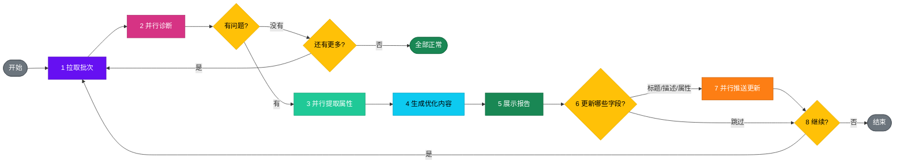
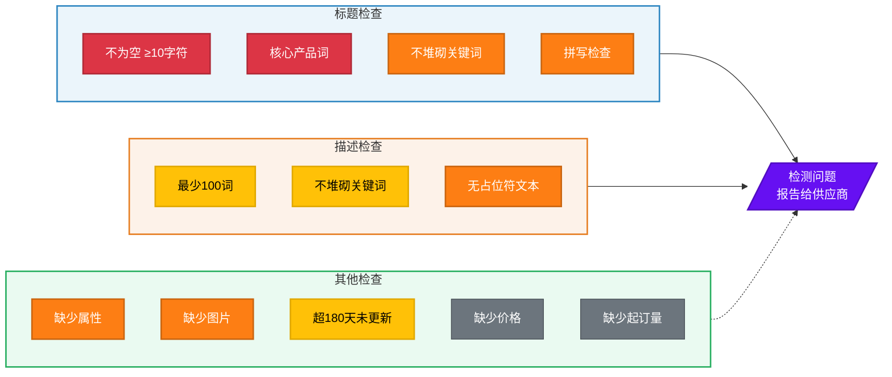
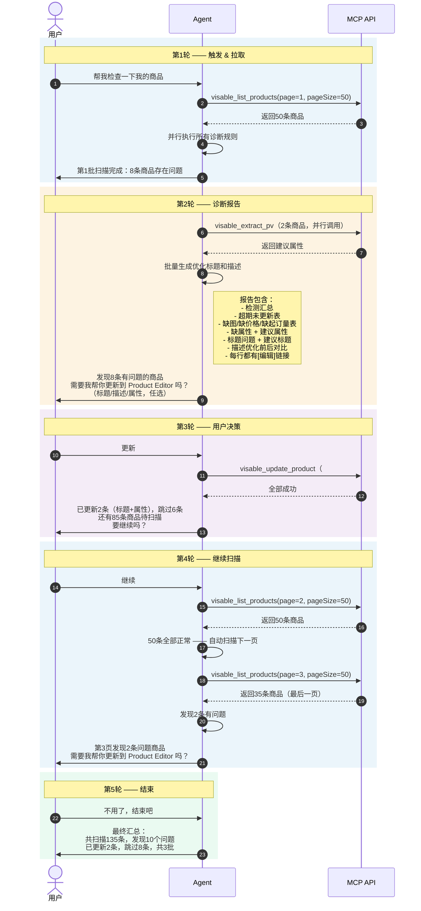

# Visable 商品优化 Skill

诊断并优化 wlw/Europages 商品信息 —— 标题、描述和商品属性。

**批量处理：** 支持可配置的批量扫描（默认 50 条，最大 200 条）。诊断、属性提取、内容优化、更新推送全部并行处理，不逐条轮询。

作者：David

---

## 目录结构

```
visable-product-opt/
├── SKILL.md                              # 主入口 —— 工作流、MCP 工具、分页逻辑
├── display.txt                           # Skill 元数据（名称、图标、版本）
├── README.md                             # 英文文档
├── README-CN.md                          # 本文档（中文）
└── reference/
    ├── quality-checker.md                # 诊断规则（标题、描述、属性、图片、更新时间、价格/起订量）
    ├── content-optimizer.md              # 标题 & 描述优化 prompt（硬约束）
    └── product-structure.md              # 商品 JSON 字段映射 & 编辑链接格式
```

### 文件职责

| 文件 | 职责 |
|------|------|
| `SKILL.md` | 流程编排：批量分页 → 并行诊断 → 并行属性提取 → 批量优化 → 确认 → 并行更新 |
| `quality-checker.md` | 诊断规则（标题、描述、属性、图片、更新时间、价格/起订量） |
| `content-optimizer.md` | 标题和描述两套独立 prompt，含硬过滤、仅基于事实、内容净化 |
| `product-structure.md` | 商品 JSON 字段到诊断变量的映射；ep/wlw 编辑链接格式 |

---

## 工作流程图



> 节点名称中的"并行"表示该步骤会同时处理多条商品，不逐条执行。

---

## 诊断规则总览



---

## 交互时序图



---

## 完整对话示例

以下是一个完整的多轮对话示例，展示用户实际看到的内容。

---

**🧑 用户：**

> 帮我检查一下我的商品

**🤖 Agent：**

> 正在扫描您的商品目录... 第1批50条商品已加载，正在检查质量...
>
> 第1批扫描完成：发现 **6条** 商品存在问题。

**检测汇总：**

| 指标 | 数量 |
|------|------|
| 本批扫描商品 | 50 |
| 存在问题的商品 | 6 |
| 标题问题 | 2 |
| 描述问题 | 2 |
| 缺少属性 | 2 |
| 缺少图片 | 1 |
| 超过180天未更新 | 2 |
| 缺少价格 | 1 |
| 缺少起订量 | 1 |

**超过180天未更新的商品：**

| # | 商品标题 | 最后更新 | 操作 |
|---|---------|---------|------|
| 1 | Industrieventil DN50 | 2024-09-12 | [编辑](https://www.wlw.de/de/...) |
| 2 | Dichtungsring NBR | 2024-08-03 | [编辑](https://www.wlw.de/de/...) |

**缺少图片的商品：**

| # | 商品标题 | 操作 |
|---|---------|------|
| 1 | Stahlrohr nahtlos | [编辑](https://www.wlw.de/de/...) |

**缺少价格的商品：**

| # | 商品标题 | 操作 |
|---|---------|------|
| 1 | Trennscheibe 125 mm | [编辑](https://www.wlw.de/de/...) |

**缺少属性的商品（已自动提取建议属性）：**

| # | 商品标题 | 建议属性 | 操作 |
|---|---------|---------|------|
| 1 | Hydraulikpumpe | Material: Stahl, Gusseisen; Druck: 250 bar; Typ: Zahnradpumpe | [编辑](https://www.wlw.de/de/...) |
| 2 | Stahlrohr nahtlos | Material: Edelstahl, Kohlenstoffstahl; Durchmesser: 50 mm, 100 mm; Norm: DIN 2448 | [编辑](https://www.wlw.de/de/...) |

> 说明：同一属性有多个值时会合并展示，如 "Material: Edelstahl, Kohlenstoffstahl"。

**标题问题：**

| # | 当前标题 | 问题 | 建议标题 | 操作 |
|---|---------|------|---------|------|
| 1 | BEST Cutting Disc!! FREE SHIPPING | 含促销用语、特殊字符 | Trennscheibe - Stahl - 125 mm | [编辑](https://www.wlw.de/de/...) |
| 2 | Pumpe | 标题过短 | Hydraulikpumpe - Zahnradpumpe - 250 bar | [编辑](https://www.wlw.de/de/...) |

**描述优化详情：**

---

**商品 #1: [BEST Cutting Disc!! FREE SHIPPING](https://www.wlw.de/de/...)**

问题：含占位符文本，描述过短（23词，最低要求100词）

**当前描述：**
> coming soon, more details to follow...

**建议描述：**
> Die Trennscheibe eignet sich fuer den Einsatz bei Stahlwerkstoffen bis 5 mm Materialstaerke. Hohe Schnittleistung und lange Standzeit durch optimierte Kornmischung.
> - Durchmesser: 125 mm
> - Dicke: 1 mm
> - Max. Drehzahl: 12.250 U/min
> - Sicherheitsnorm: EN 12413

---

**商品 #2: [Pumpe](https://www.wlw.de/de/...)**

问题：描述过短（15词，最低要求100词），缺少技术细节

**当前描述：**
> Hochwertige Pumpe fuer industrielle Anwendungen. Kontaktieren Sie uns fuer Details.

**建议描述：**
> Die Hydraulikpumpe vom Typ Zahnradpumpe eignet sich fuer den Einsatz in hydraulischen Antriebssystemen mit einem Betriebsdruck von bis zu 250 bar.
> - Typ: Zahnradpumpe
> - Max. Betriebsdruck: 250 bar
> - Foerdervolumen: 20 l/min
> - Anschluss: G 1/2"

---

> **需要我帮你把这些建议直接更新到 Product Editor 后台吗？**
>
> 你可以选择更新哪些内容：
> - **标题** —— 应用建议的标题优化
> - **描述** —— 应用建议的描述优化
> - **属性** —— 应用提取的商品属性
>
> 可以任意组合，比如："全部更新"、"只更新 #1 和 #2 的标题和属性"、"只更新描述"。

---

**🧑 用户：**

> 更新 #1 和 #2 的标题和属性

**🤖 Agent：**

> 完成！已更新2条商品（标题 + 属性），跳过4条。
>
> 还有 **85条商品** 待扫描，需要我继续检查下一批吗？

---

**🧑 用户：**

> 继续

**🤖 Agent：**

> 正在扫描第2批（50条商品）... 全部正常，自动扫描第3批...
>
> 第3批扫描完成（35条商品，最后一页）：发现 **2条** 商品存在问题。
>
> *(展示第3批的报告...)*
>
> 需要我帮你更新到 Product Editor 后台吗？

---

**🧑 用户：**

> 不用了，结束吧

**🤖 Agent：**

> **最终汇总：**
>
> | 指标 | 数量 |
> |------|------|
> | 总扫描商品数 | 135 |
> | 总发现问题数 | 8 |
> | 已更新商品数 | 2 |
> | 跳过商品数 | 6 |
> | 扫描批次数 | 3 |
>
> 全部完成！您可以随时点击上方的 [编辑] 链接手动查看剩余商品。

---

## 核心特性

| 特性 | 说明 |
|------|------|
| 批量并行处理 | 诊断、属性提取、内容生成、更新推送全部并行，不逐条轮询 |
| 可配置批量大小 | 默认50条，最大200条，用户可自定义 |
| 选择性检查 | 用户可指定只检查某些项（如"只查标题"、"只查属性"），跳过其他检查 |
| 字段粒度更新 | 标题、描述、属性三者任意组合更新，也可按行号选择特定商品 |
| 自动翻页 | 当前批次无问题时自动扫描下一批，直到发现问题或全部扫完 |
| 长描述友好展示 | 描述的优化前后对比不塞进表格，独立区块展示 |
| 属性多值合并 | 同一属性有多个值时合并为一行展示（如 Material: Stahl, Gusseisen） |
| 多语言支持 | 对话语言跟随用户，商品优化语言跟随商品本身的语言 |
