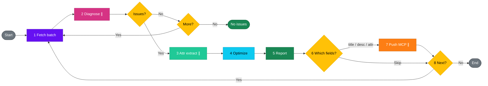
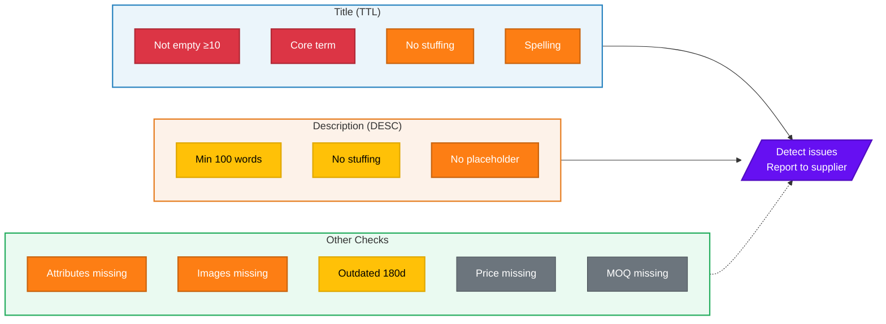
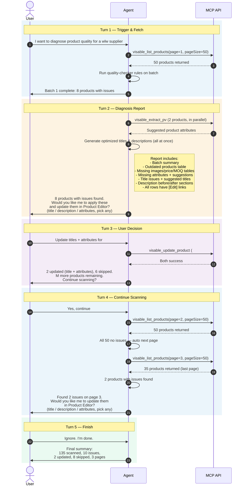

# Visable Product Optimization Skill

Diagnose and optimize wlw/ep product listings — titles, descriptions, and product attributes.

**Batch processing:** Scans products in configurable batches (default 50, max 200). All diagnosis, attribute extraction, content optimization, and update operations are processed in parallel within each batch — no sequential polling.

Author: David

---

## Directory Structure

```
visable-product-opt/
├── SKILL.md                              # Main skill entry — workflow, MCP tools, pagination logic
├── display.txt                           # Skill metadata (name, icon, version)
├── README.md                             # This document (English)
├── README-CN.md                          # 中文文档
└── reference/
    ├── quality-checker.md                # Diagnosis rules (title, description, attributes, images, staleness, price/MOQ)
    ├── content-optimizer.md              # Title & description optimization prompts (hard constraints)
    └── product-structure.md              # Product JSON key fields & edit link format
```

### File Responsibilities

| File | Role |
|------|------|
| `SKILL.md` | Orchestration: batch pagination → parallel diagnosis → parallel attribute extraction → batch optimization → approval → parallel update |
| `quality-checker.md` | Diagnosis rules (title, description, attributes, images, staleness, price/MOQ) |
| `content-optimizer.md` | Two self-contained prompts (title + description) with hard filters, evidence-only, sanitization |
| `product-structure.md` | Maps product JSON fields to diagnosis variables; defines edit link URLs for ep/wlw |

---

## Workflow Flowchart



> The `∥` symbol indicates parallel processing steps (multiple items processed at the same time).

---

## Diagnosis Rules Overview



---

## Simulated Interaction



### Full Conversation Example

Below is a complete multi-turn conversation showing exactly what the user sees.

---

**🧑 User:**

> Help me check my product listings

**🤖 Agent:**

> Scanning your product catalog... First batch of 50 products loaded. Running quality checks...
>
> Batch 1 scanned: **6 products** with issues found.

**Batch Summary:**

| Metric | Count |
|--------|-------|
| Products scanned (this batch) | 50 |
| Products with issues | 6 |
| Title issues | 2 |
| Description issues | 2 |
| Missing attributes | 2 |
| Missing images | 1 |
| Outdated (180+ days) | 2 |
| Missing price | 1 |
| Missing MOQ | 1 |

**Outdated Products (180+ days since last edit):**

| # | Product Title | Last Updated | Link |
|---|--------------|-------------|------|
| 1 | Industrieventil DN50 | 2024-09-12 | [Edit](https://www.wlw.de/de/...) |
| 2 | Dichtungsring NBR | 2024-08-03 | [Edit](https://www.wlw.de/de/...) |

**Products Missing Images:**

| # | Product Title | Link |
|---|--------------|------|
| 1 | Stahlrohr nahtlos | [Edit](https://www.wlw.de/de/...) |

**Products Missing Price:**

| # | Product Title | Link |
|---|--------------|------|
| 1 | Trennscheibe 125 mm | [Edit](https://www.wlw.de/de/...) |

**Missing Attributes (with Suggested Attributes):**

| # | Product Title | Suggested Attributes | Link |
|---|--------------|---------------------|------|
| 1 | Hydraulikpumpe | Material: Stahl, Gusseisen; Druck: 250 bar; Typ: Zahnradpumpe | [Edit](https://www.wlw.de/de/...) |
| 2 | Stahlrohr nahtlos | Material: Edelstahl, Kohlenstoffstahl; Durchmesser: 50 mm, 100 mm; Norm: DIN 2448 | [Edit](https://www.wlw.de/de/...) |

**Title Issues:**

| # | Current Title | Issues | Suggested Title | Link |
|---|--------------|--------|----------------|------|
| 1 | BEST Cutting Disc!! FREE SHIPPING | Promotional phrases, special characters | Trennscheibe - Stahl - 125 mm | [Edit](https://www.wlw.de/de/...) |
| 2 | Pumpe | Title too short | Hydraulikpumpe - Zahnradpumpe - 250 bar | [Edit](https://www.wlw.de/de/...) |

**Description Optimization:**

---

**Product #1: [BEST Cutting Disc!! FREE SHIPPING](https://www.wlw.de/de/...)**

Issues: Placeholder text, too short (23 words, minimum 100)

**Current description:**
> coming soon, more details to follow...

**Suggested description:**
> Die Trennscheibe eignet sich fuer den Einsatz bei Stahlwerkstoffen bis 5 mm Materialstaerke. Hohe Schnittleistung und lange Standzeit durch optimierte Kornmischung.
> - Durchmesser: 125 mm
> - Dicke: 1 mm
> - Max. Drehzahl: 12.250 U/min
> - Sicherheitsnorm: EN 12413

---

**Product #2: [Pumpe](https://www.wlw.de/de/...)**

Issues: Too short (15 words, minimum 100), missing technical details

**Current description:**
> Hochwertige Pumpe fuer industrielle Anwendungen. Kontaktieren Sie uns fuer Details.

**Suggested description:**
> Die Hydraulikpumpe vom Typ Zahnradpumpe eignet sich fuer den Einsatz in hydraulischen Antriebssystemen mit einem Betriebsdruck von bis zu 250 bar.
> - Typ: Zahnradpumpe
> - Max. Betriebsdruck: 250 bar
> - Foerdervolumen: 20 l/min
> - Anschluss: G 1/2"

---

> **Would you like me to apply these suggestions and update them directly in Product Editor?**
>
> You can choose what to update:
> - **Title** — apply suggested title improvements
> - **Description** — apply suggested description improvements
> - **Attributes** — apply extracted product attributes
>
> Pick any combination, e.g. "update titles and attributes for all", "update everything for #1 and #2", or "only update descriptions".

---

**🧑 User:**

> Update titles and attributes for #1 and #2

**🤖 Agent:**

> Done! 2 products updated (titles + attributes). 4 products skipped.
>
> You have **85 more products** remaining. Would you like me to continue scanning the next batch?

---

**🧑 User:**

> Yes, continue

**🤖 Agent:**

> Scanning batch 2 (50 products)... no issues found. Auto-scanning batch 3...
>
> Batch 3 scanned (35 products, last page): **2 products** with issues found.
>
> *(shows report for batch 3...)*
>
> Would you like me to update them in Product Editor?

---

**🧑 User:**

> No thanks, I'm done

**🤖 Agent:**

> **Final Summary:**
>
> | Metric | Count |
> |--------|-------|
> | Total products scanned | 135 |
> | Total issues found | 8 |
> | Products updated | 2 |
> | Products skipped | 6 |
> | Batches scanned | 3 |
>
> All done! You can click the [Edit] links above anytime to manually review the remaining products.

---

## Key Features

| Feature | Description |
|---------|-------------|
| Batch parallel processing | Diagnosis, attribute extraction, content generation, and updates all run in parallel — no sequential polling |
| Configurable batch size | Default 50, max 200, user can customize |
| Selective checks | User can specify which checks to run (e.g. "only check titles", "only check attributes"), skip the rest |
| Granular field updates | Title, description, and attributes can be updated in any combination; user can also pick specific products by row number |
| Auto-pagination | If no issues found in current batch, automatically scan the next batch until issues are found or all products are scanned |
| Long description display | Description before/after comparisons are shown as separate sections, not crammed into table cells |
| Multi-value attribute merging | When an attribute has multiple values, they are combined into one line (e.g. Material: Steel, Cast Iron) |
| Multi-language support | Conversation language follows the user; product optimization language follows the product's own language |
