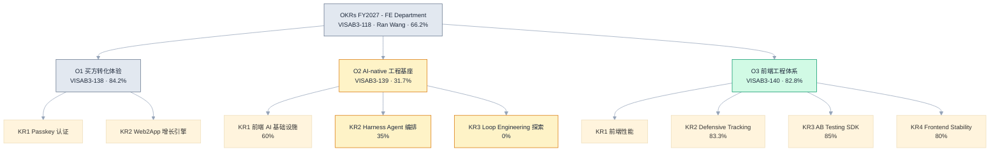

# FY27 H1 个人 OKR 与部门大 OKR 咬合分析

> 部门目标：[OKRs FY2027 - FE Department](https://home.atlassian.com/o/132de72c-a57c-4f54-8d6f-b60a3f8fcf4f/s/6661348b-dad9-44d9-b90d-e6ab64f9f894/goal/VISAB3-118/about)（VISAB3-118，Owner Ran Wang，总进度 66.2%，2026-09-21 读取）
> 个人 OKR：[FY27 H1 OKR - Yang, Eric](https://visable.atlassian.net/wiki/spaces/~71202075c2285d8115445a8b9dc5244bebf36f/pages/199065617)（199065617）
> 用途：半年汇报时把个人 OKR 挂到部门目标下呈现；识别可认领的部门缺口

## 一、部门 OKR 全景（2026-09-21 实测进度）

> 图例：绿 = 进度健康（>80%）｜黄 = 部门当前短板（O2 两条低进度 KR）｜灰 = 中性/无交集

三个 O 的 Owner 均为 Bin Xu。O2 描述中明确的量化目标：**H1 需求吞吐 +100%，H2 +300%**。

### 各 KR 目标与进度明细

| 部门 KR | 目标要点 | 进度 |
|---|---|---|
| O2-KR1 Frontend AI Infrastructure | RepoWiki 标准+全应用初始化（Q1）；FE AI Plugin v1 团队采用（H1）；人工 vs AI 人日评估 agent+效率基准（H1）；≥15 个生产级 AI Skills 覆盖 Intake→Spec→Dev→Deploy→QA（H1） | 60% |
| O2-KR2 Harness Agent Orchestration | Intake Agent MVP（8/30，≥3 种输入）；Dev Agent MVP（8/30，硬闸门+可恢复，≥70% 新需求走 dev agent）；Verify Agent MVP（8/30，staging 检查+合并+部署+5 质量门，≥5 次端到端）；**Monitoring Agent MVP（9/30：e2e 回归、埋点校验、异常检测、auto Jira，≥5 次端到端发布）** | 35% |
| O2-KR3 Loop Engineering Exploration | 8/15 部署远程 agent 运行时的自闭环 MVP，自主完成 ≥1 个真实需求端到端 | 0% 未启动 |
| O3-KR2 Defensive Tracking | GA3 防线覆盖业务 KPI（7/15）✅100%；DA→WA→FE SSOT AI 同步机制（7/30）✅100%；**GA4 防线覆盖业务 KPI（8/15）→ 50% Pending** | 83.3% |
| O3-KR4 Frontend Stability | 9/30 前全核心应用 Stability SDK 集成 + Datadog/Sentry/ODPS/埋点巡检数据连通；buyer 核心场景（HP/CSERP/PSERP/CPP/PDP/RFQ）100% 覆盖并启动存量问题治理 | 80% |
| O1-KR1/KR2（Passkey、Web2App） | buyer 侧转化：认证与增长引擎 | 84.2%（与个人工作无交集） |
| O3-KR1/KR3（性能、AB SDK） | 前端性能与 AB 能力 | 82.8% 内（边缘贡献） |

## 二、直接咬合：你就是部门 KR 的实际交付人

| # | 部门 KR | 进度 | 个人对应交付（证据） | 该 KR 剩余缺口 = 你的收尾范围 |
|---|---|---|---|---|
| 1 | **O2-KR2 · Monitoring Agent MVP**（9/30） | 40% | FE-907 Phase 1 全部 Done（M1 Subagent+Skill 脚手架 / M2 四路监控能力 / M3 编排+报告+触发 / M4 集成验证），FE-984 v2 进行中（五信号源含 AWS、按错误类型展示、能力目录、失败模式推导、置信评估）+ 4 份生命周期文档（FE-923/924/925/926） | ≥5 次真实发布端到端跑通；auto Jira 回流闭环（异常→工单→回流）。**9 月收尾正好完成这条部门 KR** |
| 2 | **O3-KR4 · Frontend Stability** | 80% | Stability SDK 8 站点组合全量推全（FE-849~852）+ 多国站点接入（FE-789）；supplier 6 应用可观测性补齐（FE-1028/1029~1034/1045，5/6 缺失→全部达基线）；Datadog 统一模板批量导入订阅（FE-1066/1067/1068 Done）；fe-stability-analysis 打通 ODPS；BI 接 Sentry；FE-1037 误报治理 | 存量问题 remediation 启动、buyer 核心场景治理收尾。**你承担了这条 KR 的主体交付** |
| 3 | **O2-KR1 · RepoWiki 全应用初始化**（Q1 目标，现 90%） | 90% | 个人完成 7 个仓库初始化并发布：supplier 6 应用（#94/#317/#242/#584/#31/#76）+ product-editor schema v2 重建（#88/#94） | 剩余为其他团队应用，你无欠账 |
| 4 | **O2-KR1 · FE AI Plugin v1**（H1 团队采用） | — | Visable FE AI Plugin：Team AI Rules SSOT（.mdc 双端）+ cr-frontend Skill + visable-plugin-marketplace 统一分发（Cursor+Qoder）+ 使用指南推广（FE-845/788/1042） | 推广使用率数据回收 |
| 5 | **O3-KR2 · GA4 防线**（8/15 目标，50% Pending） | 50% | GA4 迁移 10 个页面域 + 6 篇数据层验收 + FE-865 注册登录核心埋点 Cypress 校验 + ga4-tracking-validation Skill；GA3 与 SSOT 两条已由团队完成 100% | **卡住这条 KR 的正是 GA4 这半块**：visitors/BI 迁移合并发布 + GA4 防线补全 |

## 三、相邻咬合：有贡献、可计入份额但不主责

| 部门 KR 子项 | 个人贡献 |
|---|---|
| O2-KR1 · ≥15 个生产级 Skills（Intake→Spec→Dev→Deploy→QA 全链路） | harness 六件套（coding/testing/spec/plan/dev/change）+ jira-lifecycle 全家桶（intake/spec/dev/staging/production/change/orchestrator）+ cr-frontend + fe-stability-analysis + GA4 校验 + drawio 系列——按"生产级"口径计数可观 |
| O2-KR1 · 人工 vs AI 人日评估 agent + 效率基准 | legacy-pd-estimator Skill + 《Codex 古法人日评估 Question Log》直接对口（评估方法与口径问题清单已沉淀） |
| O2-KR2 · Intake/Dev/Verify Agent | jira-lifecycle-intake / dev / deploy-staging / deploy-production 提供 Intake、分支+PR、部署门禁部分能力；harness-coding/testing 提供 Dev/验证循环 |
| O3-KR3 · A/B Testing SDK | cr-frontend AB 实验清理评估（Step 9）+ wlwTestGroup7 实验桶治理（边缘贡献） |

## 四、可认领的部门缺口（低投入高回报）

1. **O2-KR2 · Dev Agent「≥70% 新需求走 dev agent」仅 20% 且 Pending** —— 部门 O2 最拖后腿的一条。注意：我当前的需求交付走的是个人 harness 工具链（spec→plan→code→test 门禁），**尚未使用团队 dev-agent**；H2 若以 1-2 个 Nexus 需求试点 dev-agent 并逐步全量、留度量记录，即成为该子目标的增量贡献，同时帮 O2 把 31.7% 拉起来。个人 harness 流程是现成的迁移基础，但从 0 到「≥70% 采用」仍需真实切换与度量，不可提前申报。
2. **O2-KR1 · harness orchestrator dashboard**（8/15 目标，40/100 Pending）—— harness-kit 全局任务池 + task 状态机（f48279e）是现成雏形，补 Jira 状态流转追踪即可。
3. **O2-KR3 · Loop Engineering 0% 未启动** —— harness 全链路（spec→plan→code→test→commit）是自闭环的天然种子，H2 可作为个人立项方向抢占先机。

## 五、不咬合（汇报时不要硬凑）

- **O1 全部**（Passkey 认证、Web2App 增长引擎，buyer 侧转化）：与个人工作无交集，owner Bin Xu，已 84.2% 健康。
- O3-KR1（前端性能）、O3-KR3（AB SDK 增强）主体由他人承担，仅边缘贡献，不值得占用汇报篇幅。

## 六、OKR Summary 汇报用映射表（直接可抄）

在《[Template] FY27 H1 Frontend Engineering OKR Summary》第一部分表格加「部门 OKR 对齐」列：

| 个人 KR | 部门 OKR 对齐 | 关系说明 |
|---|---|---|
| O2-KR2 工具沉淀（cr-frontend + marketplace） | O2-KR1 Frontend AI Infrastructure（FE AI Plugin v1） | 交付人 |
| O2-KR4【新增】AI 管理平台 | O2-KR1（AI 基础设施的一部分） | 交付人 |
| O3-KR2 AI 智能运维（Monitoring Agent） | **O2-KR2 Harness Agent Orchestration · Monitoring Agent MVP（9/30）** | 交付人 |
| O3-KR1 监控全覆盖（全域 100%） | **O3-KR4 Frontend Stability（9/30 SDK 全集成+四路数据连通）** | 主体交付人 |
| O3-KR3 误报治理专项 | O3-KR4（存量问题治理的组成部分） | 贡献者 |
| O1-KR1 数据基建（GA4 迁移） | O3-KR2 Defensive Tracking · GA4 防线（50%→收尾） | 收尾交付人 |
| O2-KR1 资产规范（repoWiki 6/6） | O2-KR1 · RepoWiki 全应用初始化（90%） | 交付人（供应商域部分） |
| O1-KR2 新商转化 / O2-KR3 流程创新 | （团队业务线 / O2-KR1 Skills 计数） | 参与者 |
| Nexus 项目群（H2） | ——（H2 范围，暂不映射） | —— |

**一句话总结**：部门 O2（AI-native 工程基座，31.7%）是当前短板，而你的 Monitoring Agent、FE AI Plugin、RepoWiki、Skills 正是 O2-KR1/KR2 的实际交付物；部门 O3-KR4（Stability）和 O3-KR2 GA4 两条已进入收尾期的 KR 也由你承担主体/收尾。你的半年工作恰好压在部门 OKR 最需要的两个方向上。
