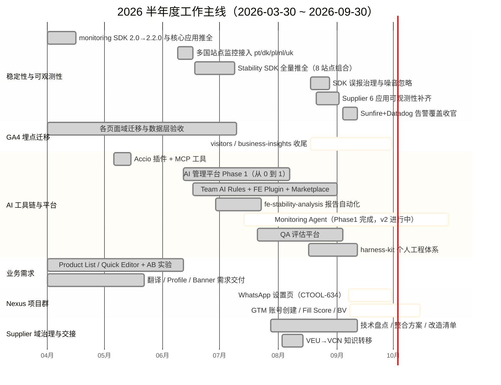

# 2026 半年度工作总结：稳定性体系补齐 + AI 工程化从 0 到 1，业务需求按期交付

> 统计范围：2026-03-30 ~ 2026-09-30（数据截至 2026-09-12）· 数据来源：GitHub（junyang-visable）、Jira/Confluence（visable.atlassian.net）· 状态标注：✓=平台数据可查证，⚠=引用自过程文档待复核
> 明细数据见本目录 `data/`（github-prs / github-commits / confluence-pages / jira-issues）

## 一句话结论

半年内以「前端稳定性体系建设」和「团队 AI 工程化」双主线，交付 130 个 PR（77% 合并率）、关单 129 张（占经手工单 79%）、沉淀 51 篇文档；业务侧 Product Editor 改版 AB 实验取得 save +15%~18% 的正向结果，9 月起转入 Nexus 项目群交付。

## 数据总览

| 维度 | 数量 | 说明 |
|---|---|---|
| GitHub PR | 130（合并 101） | 覆盖 27 个仓库（org 26 + 个人 1） |
| GitHub 提交 | 236 | org 132 + 个人 my-ai 104（仅默认分支口径） |
| Jira 工单 | 177（经手 164 + 仅创建 13） | Done/Closed 129（79%）；Epic 18 |
| Confluence 文档 | 51 篇 | TF / TCPT / 个人空间 |
| 主导 Epic | 16 个 | 稳定性 6 · AI 平台/工具 6 · 业务/其他 4 |

PR 月度分布：3月 1 → 4月 23 → 5月 11 → 6月 28 → 7月 17 → 8月 29 → 9月 21，6-9 月保持高位（AI 平台与监控体系密集交付期）。

## 半年工作主线时间轴

> 图例：done=已完成交付｜active=进行中

## 核心工作项与成果

### 1. 前端稳定性与可观测性体系（贯穿全期的最大主线，约 40+ PR）

**做了什么**：
- **监控 SDK 迭代**（frontend-monitoring 仓库）：monitoring-core 从 2.0 迭代到 2.2.0 —— 白屏检测改进、上报数据结构重建、服务端/客户端上报 API 统一、第三方噪音内置忽略列表、页面导航中断 fetch 的误报修复（FE-1037）。
- **Stability SDK 全量推全**：search-frontend 三阶段覆盖 8 个站点组合（ep/de·fr·tr·it·es + wlw/ch·at·de，FE-849~852），并在 9 月完成 search / unified-search / homepage 三大核心应用 SDK 升级（FE-1045）。
- **Supplier 域 6 应用可观测性补齐**（FE-1028 Epic）：business-insights / supplier-onboarding / ad-center / visitors / customer-dashboard 全部接入 Sentry + 稳定性 SDK + Web Vitals（页面性能指标），含 IaC 环境变量配套。治理前 6 应用中 5 个缺稳定性 SDK、1 个 Sentry 未接入；治理后全部达到 product-editor 同等基线（✓ 见 Confluence《稳定性现状总览》9 月版：6 应用全部"完整"）。
- **监控告警覆盖收官**（FE-1066 Epic）：按 homepage 5-monitor 标准模板，核心应用 + supplier 域长尾应用批量生成并导入 Datadog 监控与钉钉订阅（FE-1067/1068 已 Done）；另完成 Sunfire（阿里内部监控平台）侧数据结构适配（FE-764）。
- **线上问题调查**：2026-08-24 CloudFront 稳定性指标激增调查——定位为爬虫流量噪音而非 CDN 故障，真实用户无影响，输出调查报告沉淀方法论。

**成果**：搜索/首页/商编核心应用与 supplier 域共 10+ 个前端应用实现「错误上报 + 性能量化 + 告警订阅」全覆盖，团队从"有监控"走向"能准确发现问题"。

### 2. 团队 AI 工程化与 AI 平台建设（第二大主线，约 45+ PR）

**做了什么**：
- **AI Management Platform Phase 1**（FE-831 Epic，12 个子任务全部 Done）：v-ai-platform 仓库从 0 到 1——React+Vite 自建、企业 SSO 登录（Azure AD，技术方案文档沉淀）、开放市场（发现/详情/收藏/发布/安装/个人中心）、staging+生产部署流水线与 IaC、上线独立域名 ai.visable.com（PIT-3398）；期间完成 Nuxt 4 迁移与 repoWiki 同步。内部 Skill/MCP 资产从此有了统一的「发现→理解→安装→贡献」入口（配套中英双语 PRD）。
- **Visable FE AI Plugin**（FE-845）：团队级 AI Rules 单一源（.mdc，同步 Cursor/CLAUDE.md）、cr-frontend 代码评审 Skill（含 HITL 人工确认、SEO 评估合并、AB 实验清理评估、SSR 安全规则 FE-1042）；建立 visable-plugin-marketplace 统一分发仓库，支持 Cursor 与 Qoder 双端安装（FE-1042/#10-#12），并产出《Marketplace 使用指南》向全团队推广。
- **fe-stability-analysis Skill**（FE-872 Epic，8 个子任务 Done）：将每周 1-2 小时的稳定性人工分析（手写 SQL → DataWorks 执行 → 日均归一 → 报告拼装）封装为自动化编排 Skill（ODPS 查询 + 缓存 + Markdown 报告），并完成团队内部分享。
- **Monitoring Agent**（FE-907 Phase 1 Done；FE-984 进行中）：Harness 流水线的线上监控阶段——五信号源采集（新增 AWS/CloudWatch）、按错误类型展示、可检索监控能力目录、需求链路解析（PRD→AC→feature→commit/PR）、失败模式推导与监控覆盖度置信评估；配套 FE-923/924/925/926 四份生命周期文档（PRD/方案/验收全套）。
- **QA Evaluation Platform**（FE-930 Epic，6 子任务 Done）：v-ai-platform 内从 0 到 1 的 QA 评估平台前端（仪表盘、评估任务生命周期、多视角 Tab）。
- **个人工程体系 harness-kit**（my-ai，104 commits）：可复用的 coding/testing harness（workspace 模式、全局任务池、plan 确认闸门）+ drawio-roadmap / GA4 校验 / Jira 工作汇总 / executive-reporting 等 Skills，形成个人 6-skill 家族并持续迭代。
- **早期探索**（5 月）：Visable Assistant（Accio）插件从设计到落地（v-agent-hub-bamboo）、supplier-backend-mcp-service MCP 工具注册重构。

**成果**：AI 从"个人提效工具"升级为"团队资产"——规范、评审、监控、评估四类能力全部 Skill 化/平台化并开放安装。

### 3. GA4 埋点迁移与数据闭环（上半年业务主线之一）

**做了什么**：完成约 10 个页面域的 GA4 迁移与事件补齐——Product Editor、Company Overview、Company Editor/Creation、User Frontend、Signin/Signup、Top Ranking Products、Product Posting 等（FE-759/760/761/762 + PGS-134/232/233/555/556/557/668/671 等）；为 6 大页面域产出数据层验收 backlog 文档并逐项核验；supplier 注册登录核心埋点完成 Cypress 自动化校验（FE-865）；GA4 tracking-validation Skill 沉淀为个人工具。

**成果**：商家后台全链路行为数据完成 GA4 迁移收口，支撑 OKR「数据看板覆盖率 100%」目标（⚠ 覆盖率达标口径需与数据团队复核）；visitors 与 business-insights 两应用迁移在收尾（Code Review 中）。

### 4. Product Editor 业务需求与 A/B 实验（4~6 月）

**做了什么**：Product Listing 改版 + Quick Editor 全流程（CTOOL-514 Epic，4.2 需求发布、6.2 推全上线）；AI 建议类需求（Category & Keywords AB 实验、API 参数扩展）；PPP 需求 Epic（CTOOL-491）；生产缺陷快速修复（CTOOL-500/501/502）；AI 采纳率埋点（CTOOL-522）；登录态 header 状态修复（FE-902）；AB 实验清理释放实验桶（wlwTestGroup7）。

**成果**（✓ 记录于《FY27 H1 OKR 成果》页面）：
- Quick Editor：save action UV **+15%**、save counts **+18%**（去年同期为 -6.6%）
- AI Keywords 采纳率 **22.61% → 53.60%**，AI Category 采纳率 **19.24% → 41.01%**

### 5. Nexus 项目群启动（9 月起，进行中）

**做了什么**：
- **WhatsApp Integration 前端**（CTOOL-634 Epic）：消息提醒设置页跨 5 仓库改造——routing-lib 新增 SUPPLIER_SETTINGS_ROUTE、visable-vue 导航入口、product-editor 设置页、wlw_nginx 边缘路由与 BFF 代理、IaC 环境域名（CTOOL-635/636/637 均 Ready for QA）。
- **GTM Phase 1**：Alibaba GGS 账号创建前端（CTOOL-679，In Progress）；Product Fill Score 新权重口径调整（CTOOL-678，QA 中）；Alibaba BV 状态展示立项（CTOOL-683）。
- **AI Lead Enrichment** 前端 Epic 立项（FE-1075）。
- 产出 Nexus 多项目 roadmap（v0.7→v1.2，drawio 可视化）用于跨团队排期对齐。

### 6. Supplier 域治理与 VEU→VCN 交接（7~9 月）

**做了什么**：主导 supplier 前端 6 应用的技术盘点与方案产出——改造必要性盘点（稳定性/repoWiki/性能现状矩阵）、项目整合方案（6 应用 → 2-3 个，分 4 步实施）、BFF vs 同源调用分析、路由与本地调试工具文档（routes/init.sh）、P0-P2 改造清单（9 月仍在持续更新）；承接 VEU→VCN 知识转移（KT Question List、14 项 In-Flight 项目清单、监控告警交接）；repoWiki 知识库在 6 个 supplier 应用全部初始化（schema v2）；customer-dashboard 补齐 CI 门禁与死代码清理（FE-1063/1064）。

**成果**：supplier 域从"散点维护"形成统一技术资产视图与改造路线图，FE-1062 技术重构 Epic 已立项，交接无断点。

## 进行中与下半年重点

| 事项 | 状态 | 备注 |
|---|---|---|
| Nexus WhatsApp 设置页 | Ready for QA | CTOOL-634，3 子任务待 QA 回归 |
| GTM Phase 1 账号创建 | In Progress | CTOOL-679 |
| Monitoring Agent v2（覆盖度诊断） | In Progress | FE-984，M2-M4 子任务进行中 |
| GA4 visitors / BI 迁移 | Code Review | FE-758 / FE-1020 |
| Supplier 技术重构 | Epic 已立项 | FE-1062，依赖整合方案拍板 |
| unified-search / visitors Nuxt 4 迁移 | 长期任务 | FE-740 / FE-745 |
| cr-frontend Skill 增强（HITL 2.0 等） | Backlog | FE-1041/1043/1076/1077 |

## 数据口径与局限性

1. **GitHub 提交**仅统计默认分支（API 限制），squash 合并 PR 计 1 条提交；工作面以 PR 清单（130 个）为准。routing-lib / visable-vue / wlw_nginx 等仓库的 9 月 PR 尚未合并，未计入提交数。
2. **Jira** 含 2026-05 批量关闭的历史遗留工单（约 30 条，2024-2025 年创建），已标注"历史清理"，不计入本半年核心工作；FE-727/755 等期前完成项已单独标注。
3. **Confluence** 时间为最后编辑时间；共 51 篇与 CQL totalCount 一致。
4. AB 实验结果与 AI 采纳率数字引自《FY27 H1 OKR 成果》页面，属过程记录（⚠），对外引用前建议与数据看板复核。
5. 本目录数据由脚本于 2026-09-12 采集，9-12 之后（至 9-30）的增量未包含。

## 附录

- `data/github-prs.md` —— 130 个 PR 按仓库明细（含状态与合并日期）
- `data/github-commits.md` —— 236 条提交按仓库/月度明细
- `data/confluence-pages.md` —— 51 篇文档按主题分组（含链接）
- `data/jira-issues.md` —— 177 条工单全量明细（含状态/类型/备注与采集 JQL）
